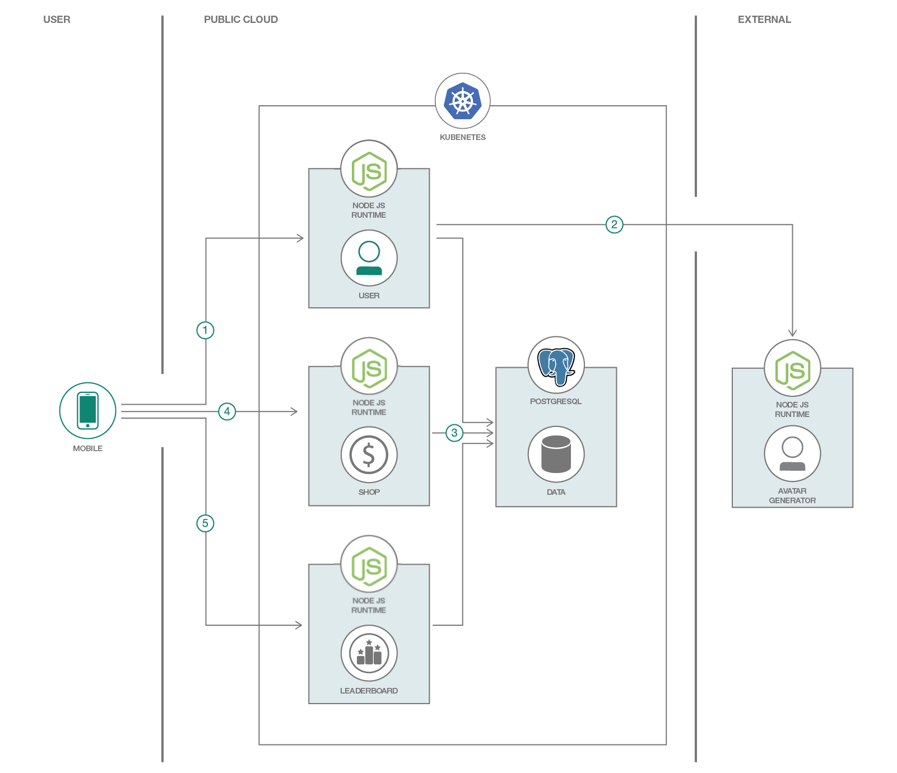

# Develop Hybrid Mobile App with Microservices backend

In this sample, we will create a simple step tracker mobile app developed using Ionic. The application's backend is composed of microservices that are written in Node JS. The application's backend microservices will be deployed in Kubernetes, a container orchestration platform. The sample app is a simple step tracker that rewards users with "fitcoins". 

When you have completed this sample, you will understand how to:

* Build server-side application using microservices written in Node JS
* Use Node JS to connect to a Database
* Deploy the backend microservices in Kubernetes
* Integrate an Ionic app with the application backend
* Make Kubernetes available under a public domain with TLS.

## Flow



1. The first time the app opens, it would try to register through the Users microservice.
2. The Users microservice communicates with an external service for its avatar assignment to the user.
3. The Users microservice then persists the user info in the database. The Users microservice would also update the steps of the users and award them "fitcoins".
4. The Leaderboard microservice provides a way to give the users standings with their steps count based on the stored data in the database.
5. The Shop microservice will get the products from the database where users can exchange them with their "fitcoins". This is also where the APIs for creating the transactions on updating the "fitcoins" of the users.

## Included Components

* [IBM Cloud Kubernetes Service](https://console.bluemix.net/docs/containers/container_index.html): IBM Bluemix Container Service manages highly available apps inside Docker containers and Kubernetes clusters on the IBM Cloud.
* [NodeJS](https://nodejs.org/): Node.js® is a JavaScript runtime built on Chrome's V8 JavaScript engine.
* [PostgreSQL](https://www.postgresql.org/): Sophisticated open-source Object-Relational DBMS supporting almost all SQL constructs.

## Few considerations

1. In a real time scenario, to compute the number of steps we would use a pedometer on the application. In the sample, to be able to use simulate / test on web, we are using a manual UI element (button) that when pressed adds the steps. 
2. As we use IBM Cloud Kubernetes Service, exposing apps via Ingress is not supported in Lite clusters. In such case, work around either creating a router application that frontends the backend microservices (or) expose apps using NodePort and configure the client app with the exposed NodePorts

## Featured Technologies

* [Container Orchestration](https://www.ibm.com/cloud/container-service): Automating the deployment, scaling and management of containerized applications.
* [Databases](https://en.wikipedia.org/wiki/IBM_Information_Management_System#.22Full_Function.22_databases): Repository for storing and managing collections of data.
* [Microservices](https://www.ibm.com/developerworks/community/blogs/5things/entry/5_things_to_know_about_microservices?lang=en): Collection of fine-grained, loosely coupled services using a lightweight protocol to provide building blocks in modern application composition in the cloud.
* [Ionic](https://ionicframework.com/): Ionic is the app development platform  to build cross platform mobile, web, and desktop apps all with one shared code base

# Prerequisites

* Create a _Standard_ Kubernetes cluster with [IBM Cloud Kubernetes Service](https://cloud.ibm.com/kubernetes/catalog/cluster) to deploy in cloud.
* Setup access to your cluster using the 'Access' instructions available in the Cluster details page from the IBM Cloud dashboad
* Install `Node.js` by downloading the setup from https://nodejs.org/en/ (Node.js 8.x or above)
```
$ node --version
v8.6.0
```
* Install Cordova
```
$ sudo npm install -g cordova@7.0.1
$ cordova --version
7.0.1
```
* Install Ionic
```
$ sudo npm install -g ionic@3.19.0
$ ionic --version
3.19.0
```
* [Optional] If you want to run the mobile app in a Android / iPhone device, install [Android Studio](https://developer.android.com/studio/install) / [Xcode](https://developer.apple.com/xcode/) for the respective paltforms.
* Install [Git] (https://git-scm.com/book/en/v2/Getting-Started-Installing-Git) CLI

# Steps

### 1. Clone the repo
```
$ git clone https://github.com/bloomcode/mobile-app-and-microservices-with-ibm-cloud.git
$ cd mobile-app-and-microservices-with-ibm-cloud
```
### 2. Create and Deploy Backend Microservices

* Ensure you've a namespace setup in IBM Container Registry. 
  - `ibmcloud cr namespace-list` lists the available namespaces
  - `ibmcloud cr namespace-add <namespace>` to create a namespace

* The source code for backend microservices are available in their respective folders in `containers/src` folder. You can open the repository folder in VS Code on IDE of your choice.

* Build the container images for the microservices and push them to IBM Container Registry
```
$ ibmcloud cr build -t <region>.icr.io/<namespace>/fitlead-users:latest containers/src/users
$ ibmcloud cr build -t <region>.icr.io/<namespace>/fitlead-shop:latest containers/src/shop
$ ibmcloud cr build -t <region>.icr.io/<namespace>/fitlead-leaderboard:latest containers/src/leaderboard
```
**Note:**  Depending on the ibmcloud user plan, your ability to push images onto ibmcloud container registry might be limited.

**Note:** You can run the images locally on your machine if you have a Docker installation
```
docker run -d  -p 31163:5432 postgres:9.6.2-alpine -e POSTGRES_HOST=localhost -e POSTGRES_PORT=31163 -e POSTGRES_DB=fitleaddb -e POSTGRES_USER=postgres

docker build -t fitlead-users containers/src/users
docker run -d -p 8080:8080 -e POSTGRES_HOST=localhost -e POSTGRES_PORT=31163 -e POSTGRES_DB=fitleaddb -e POSTGRES_USER=postgres fitlead-users 

docker build -t fitlead-leaderboard containers/src/leaderboard
docker run -d -p 8081:8081 -e POSTGRES_HOST= localhost -e POSTGRES_PORT=31163 -e POSTGRES_DB=fitleaddb -e POSTGRES_USER=postgres fitlead-leaderboard 

docker build -t fitlead-shop containers/src/shop
docker run -d -p 8082:8082 -e POSTGRES_HOST= localhost -e POSTGRES_PORT=31163 -e POSTGRES_DB=fitleaddb -e POSTGRES_USER=postgres fitlead-shop
```

### 3. Create the credentials and deploy PostgreSQL

* You'll need to deploy a simple Postgres container in your cluster. This is only for testing (data will be deleted if container is destroyed/restarted). You'll need to setup your own persistency or you can use [Compose for PostgreSQL](https://www.ibm.com/cloud/compose/postgresql) for production.

* Create the credentials and deploy PostgreSQL
```
$ kubectl create cm postgres-cm --from-env-file=containers/config/postgres-config.env
$ kubectl apply -f containers/config/postgres.yaml
```
* Make sure the postgres container is running
```
$ kubectl get pods
```

### 4. Deploy Backend Microservices

* Edit these Kubernetes manifests files in `containers/config` folder to use your own images
  * leaderboard.yaml
  * shop.yaml
  * users.yaml

For Example, containers/config/leaderboard.yaml
...
    image: us.icr.io/fitlead/node-shop
    ## change the value to the images you just built in the previous step.
...

* You can now deploy the microservices
```
$ kubectl apply -f containers/config/leaderboard.yaml
$ kubectl apply -f containers/config/shop.yaml
$ kubectl apply -f containers/config/users.yaml
```
* Make sure the 3 of them are running
```
$ kubectl get pods
```

### 5. Expose with Kubernetes Ingress

* You would want to expose the backend you deployed so that the mobile app can communicate with it. With Kubernetes Ingress, this would allow you to expose these microservices. You can use the provided Ingress Subdomain that came with the IBM Cloud Kubernetes Service.
* Get the Ingress subdomain and Ingress secret values 
```
$ bx cs cluster-get <Your cluster name here>
```
* Modify `containers/config/ingress.yaml` to use the provided subdomain you have obtained above
> If you want to use your own domain, proceed to step #7

* Apply the Kubernetes Ingress resource
```
$ kubectl apply -f containers/config/ingress.yaml
```

**Note:** If you are using a Lite cluster where Ingress is not available, you need to expose the microservices as NodePorts
and access the microservices using NodePort. To expose using NodePort, uncomment NodePort in corresponding manifests at
`containers/config` and reapply the yaml configuration.

### 6. Test the backend routes to make sure they are running properly

```
$ export URL=https://YOUR_INGRESS_SUBDOMAIN

## Create a user
$ curl -X POST -H 'Content-type: application/json' -d "$(curl $URL/users/generate)" $URL/users

{"name":"Gisk Igofrow","userId":"6A213D99-7C08-4BF2-A250-D24E3310236B","stepsConvertedToFitcoin":0,"image":"..." ...}

## Get the users
$ curl $URL/users

[{"name":"Gisk Igofrow","userId":"6A213D99-7C08-4BF2-A250-D24E3310236B" ...}]

## Get the products
$ curl $URL/shop/products

[{"item":"Smart Watch","coins":20,"stock":100,"name":"Smart Watch"},{"productId":"shoes","price":50,"quantity":25,"name":"Running Shoes"},{"productId":"bodyScale","price":5,"quantity":50,"name":"Body Scale"}]
```

### 7. Configure and run the Mobile app

* Configure the backend URLs here: 
```
ionic-app/src/pages/user/user.ts
```
> Note: We separated the URLs into 3 backend URLs, to be able to work with applications exposed via NodePort, If you're using Ingress or if you have a router app that frontends the communication to microservices you can just use change the app to use 1   URL here

* Build the Ionic app
```
cd fitlead-ionic-app
npm install 
ionic build
ionic serve
```
* For running on iOS / Android 
```
ionic cordova platform add <ios | android>
ionic cordova prepare
ionic build
ionic cordova run <ios | android>
```

### 8. Use your own domain name and manage certificate with Let's Encrypt

To enable TLS in your own domain, you may want to automate issuance of the TLS certificates. You can do this with `cert-manager` to request certificates from Let's Encrypt.

* Go to your domain registrar and create an _**A record**_ for your domain to point to the IP address of your Kubernetes ingress. You can get the IP address of your ingress by doing:

```
$ kubectl get ing

## NAME      HOSTS                  ADDRESS          PORTS     AGE
## ingress   www.ibm-fitchain.com   169.48.XYZ.XYZ   80, 443   2d
```

* You would need to first initialize `helm`. This will install `tiller` in your cluster.

```
$ helm init
```

* You can now install `cert-manager`

```
$ helm install \
    --name cert-manager \
    --namespace kube-system \
    stable/cert-manager
```

* Modify `cert-manager/issuer.yaml` to use your own valid email address.
  > More details [here](https://cert-manager.readthedocs.io/en/latest/tutorials/acme/http-validation.html)

```
...
email: EMAIL_ADDRESS
## change it to a valid one
...
```

* Deploy the issuer resource

```
$ kubectl apply -f cert-manager/issuer.yaml
```

* Modify `cert-manager/certificate.yaml`

```
...
spec:

  ## THIS WILL PRODUCE A CERTIFICATE NAMED ibm-fitchain-com-tls
  secretName: ibm-fitchain-com-tls
  issuerRef:
    name: letsencrypt-prod

  ## PROVIDE YOUR OWN DOMAIN NAME
  commonName: www.ibm-fitchain.com
  dnsNames:
  - www.ibm-fitchain.com
  acme:
    config:
    - http01:
        ingressClass: nginx
      domains:

      ## PROVIDE YOUR OWN DOMAIN NAME
      - www.ibm-fitchain.com
    - http01:
        ingress: my-ingress
      domains:

      ## PROVIDE YOUR OWN DOMAIN NAME
      - www.ibm-fitchain.com
```

* Deploy the certificate resource

```
$ kubectl apply -f cert-manager/certificate.yaml

## Wait for the certificate to get issued
$ kubectl describe certificate
```

* Once successful, you can check in your browser if your domain is working properly. 

# Links

* [cert-manager](https://cert-manager.readthedocs.io/en/latest/index.html): A native Kubernetes certificate management controller. It can help with issuing certificates from a variety of sources, such as Let’s Encrypt, HashiCorp Vault or a simple signing keypair.

# Learn more

* **Kubernetes on IBM Cloud**: Deploy and manage your containers in [Kubernetes on IBM Cloud](https://www.ibm.com/cloud/container-service).
* **Microservices and Container Orchestration**:
Interested in microservices applications? Check out our other [Microservices Code Patterns](https://developer.ibm.com/code/technologies/microservices/) and [Container Orchestration Code Patterns](https://developer.ibm.com/code/technologies/container-orchestration/).

# License
This code pattern is licensed under the Apache Software License, Version 2.  Separate third party code objects invoked within this code pattern are licensed by their respective providers pursuant to their own separate licenses. Contributions are subject to the [Developer Certificate of Origin, Version 1.1 (DCO)](https://developercertificate.org/) and the [Apache Software License, Version 2](http://www.apache.org/licenses/LICENSE-2.0.txt).

[Apache Software License (ASL) FAQ](http://www.apache.org/foundation/license-faq.html#WhatDoesItMEAN)